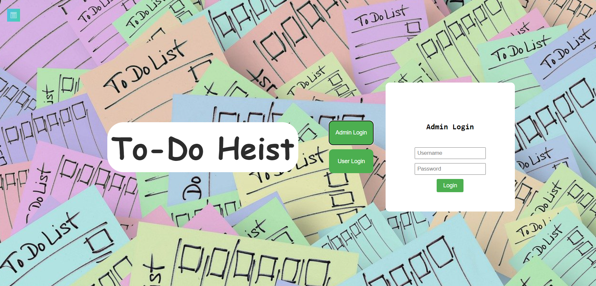
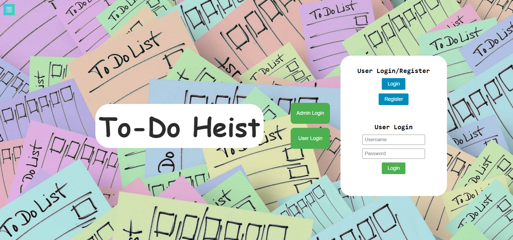
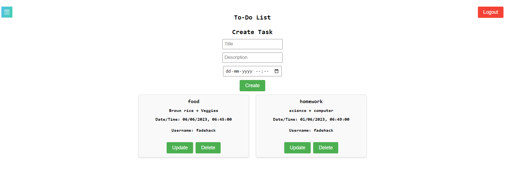
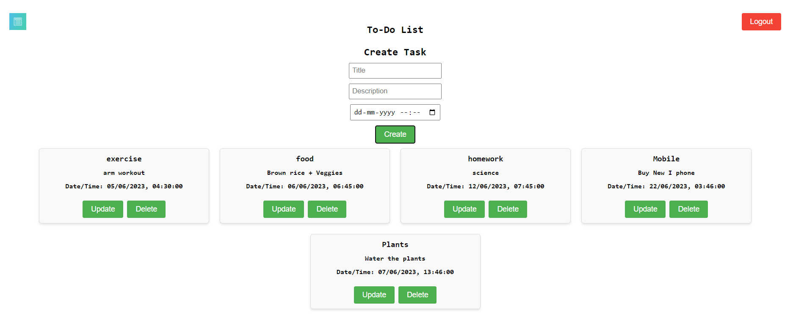
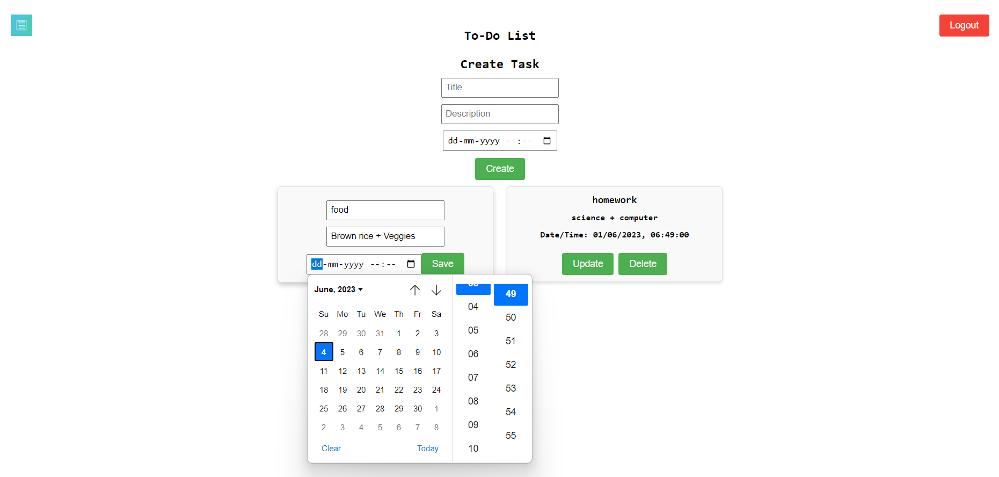

# ToDo Heist

This project is a web-based task management system called "ToDO Heist". It allows users to create, manage, and track tasks. The system supports both admin and user roles, with different functionalities available to each role.

## Tech Specifications

- Built with HTML, CSS, and JavaScript.
- Backend powered by Node.js and Express.
- Database using MongoDB.

## Temporary Login Credentials

- Admin:
  - Username: Admin
  - Password: adminLog

- User:
  - Username: fadehack
  - Password: fadehackLog

## Screenshots

- Home Page
  

- Admin Login
  

- User Login/Register
  

- Admin Task View
  

- User Task View
  

- Task Updation
  

## Functionality

- Performs CRUD (Create, Read, Update, Delete) operations on tasks.
- Admin can manage tasks and see tasks created by all users.
- Users can view and update their tasks.

## How to Run the Project

1. Clone the repository.
2. Install the dependencies using `npm install`.
3. Run the application using `npm start`.
4. Access the application in your web browser at `http://localhost:3000`.

## License

This project is licensed under the MIT License. See the [LICENSE](LICENSE) file for more details.
